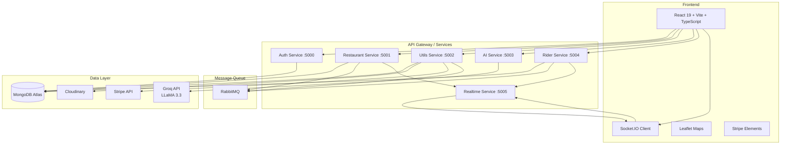
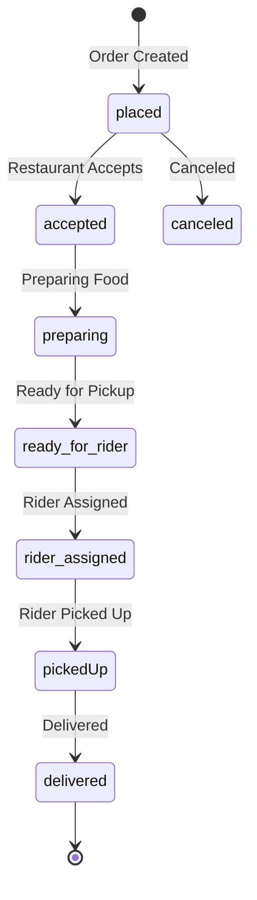

<p align="center">
  
  
  
  
  
  
  
  
  
  
</p>

# JettyOrders — Food Delivery Platform

A production-grade food delivery platform built on a **microservices architecture** with real-time order tracking, AI-powered recommendations, and role-based access for customers, restaurant owners, and riders.

## Architecture



## Order Lifecycle



## Tech Stack

| Layer | Technology |
|-------|-----------|
| **Frontend** | React 19, TypeScript, Vite, Tailwind CSS v4, React Router v7 |
| **State / HTTP** | Axios, React Context, react-hot-toast |
| **Maps** | React-Leaflet, Leaflet |
| **Auth** | Express, JWT, bcryptjs, Google OAuth (via `@react-oauth/google`) |
| **Database** | MongoDB Atlas, Mongoose (7 collections) |
| **Message Queue** | RabbitMQ (amqplib) |
| **Real-time** | Socket.IO (rooms, internal events) |
| **Payments** | Stripe (Payment Intents) |
| **Media** | Cloudinary, Multer, DataUri |
| **AI** | Python FastAPI, LangChain, Groq (LLaMA 3.3-70b) |
| **Email** | Nodemailer |
| **Validation** | Zod |

## Services

| Service | Port | Role |
|---------|------|------|
| **auth** | 5000 | User registration, login, Google OAuth, JWT issuance, password reset |
| **restaurant** | 5001 | Restaurant CRUD, menu items, cart, addresses, order placement, payment consumer |
| **utils** | 5002 | Stripe payment intents, Cloudinary image uploads, payment event producer |
| **ai** | 5003 | Dish/restaurant suggestions, review generation via Groq LLM |
| **rider** | 5004 | Rider registration, location updates, availability toggling, order acceptance |
| **realtime** | 5005 | Central WebSocket gateway — order notifications, rider location broadcasting |
| **frontend** | 5173 | SPA with 16 pages, role-based routing, real-time maps |

## API Reference

### Auth Service — `/api/auth`

| Method | Endpoint | Auth | Description |
|--------|----------|------|-------------|
| POST | `/register` | — | Register new user (Google OAuth or email) |
| POST | `/login` | — | Login with email/password |
| POST | `/forgot-password` | — | Send password reset email |
| POST | `/reset-password` | — | Reset password |
| PUT | `/add/role` | ✓ | Assign role (customer/seller/rider) |
| GET | `/me` | ✓ | Get current user profile |

### Restaurant Service — `/api/restaurant`

| Method | Endpoint | Auth | Description |
|--------|----------|------|-------------|
| POST | `/new` | Seller | Create restaurant (with image upload) |
| GET | `/my` | ✓ | Get own restaurant |
| PUT | `/edit` | Seller | Update restaurant details |
| PUT | `/status` | Seller | Toggle open/closed |
| GET | `/nearby` | — | Find restaurants near location (geo query) |
| GET | `/all` | — | List all restaurants |
| GET | `/:id` | ✓ | Get single restaurant |
| DELETE | `/delete` | Seller | Delete restaurant + menu items |

### Menu Items — `/api/menu-item`

| Method | Endpoint | Auth | Description |
|--------|----------|------|-------------|
| POST | `/new` | Seller | Add menu item |
| GET | `/all` | ✓ | Get items for own restaurant |
| GET | `/public/:restaurantId` | — | Public menu for restaurant |
| GET | `/all-available` | — | All available items |
| PUT | `/:id` | Seller | Update menu item |
| PATCH | `/:id/status` | Seller | Toggle availability |
| DELETE | `/:id` | Seller | Delete menu item |

### Cart — `/api/cart`

| Method | Endpoint | Auth | Description |
|--------|----------|------|-------------|
| GET | `/all` | Customer | Get cart contents |
| POST | `/add` | Customer | Add item to cart |
| PUT | `/:menuItemId` | Customer | Update item quantity |
| DELETE | `/:menuItemId` | Customer | Remove item |
| DELETE | `/clear` | Customer | Clear entire cart |

### Orders — `/api/order`

| Method | Endpoint | Auth | Description |
|--------|----------|------|-------------|
| POST | `/create` | ✓ | Place order (calculates fees + distance) |
| GET | `/payment/:orderId` | Internal | Fetch order for Stripe payment |
| GET | `/my-orders` | ✓ | Get user's order history |
| GET | `/restaurant/:restaurantId` | Seller | Get restaurant's orders |
| PUT | `/:orderId/status` | Seller | Update order status |
| GET | `/:orderId` | ✓ | Get single order details |

### AI Service — `/api/ai`

| Method | Endpoint | Description |
|--------|----------|-------------|
| POST | `/suggest-dish` | AI dish name + description from keywords |
| POST | `/suggest-restaurants` | Restaurant recommendations |
| POST | `/generate-review` | Generate review text for a restaurant |

### Utils Service

| Method | Endpoint | Description |
|--------|----------|-------------|
| POST | `/api/upload` | Upload image to Cloudinary |
| POST | `/api/payment/create-payment-intent` | Create Stripe PaymentIntent |
| POST | `/api/payment/confirm` | Confirm Stripe payment |

### Rider Service — `/api/rider`

| Method | Endpoint | Auth | Description |
|--------|----------|------|-------------|
| POST | `/register` | ✓ | Register as rider (with license + image) |
| GET | `/me` | ✓ | Get rider profile |
| PUT | `/location` | ✓ | Update current location |
| PATCH | `/availability` | ✓ | Go online/offline |
| POST | `/accept-order/:orderId` | ✓ | Accept delivery order |

## Database Schema

### User (auth & rider services)
| Field | Type | Description |
|-------|------|-------------|
| `name` | String | Display name (from Google OAuth) |
| `email` | String | Unique email |
| `image` | String | Google profile photo URL |
| `role` | String | `customer`, `seller`, `rider`, or `null` |
| `restaurantId` | String | Linked restaurant (if seller) |

### Restaurant
| Field | Type | Description |
|-------|------|-------------|
| `name` | String | Restaurant name |
| `image` | String | Cloudinary URL |
| `address` | String | Formatted address |
| `ownerId` | String | Reference to User |
| `phone` | Number | Contact number |
| `isVerified` | Boolean | Admin verification flag |
| `isOpen` | Boolean | Open/closed status |
| `autoLocation` | 2dsphere | GeoJSON point for proximity search |

### MenuItem
| Field | Type | Description |
|-------|------|-------------|
| `name` | String | Item name |
| `price` | Number | Price in USD |
| `image` | String | Cloudinary URL |
| `category` | String | Category name |
| `restaurantId` | ObjectId | Reference to Restaurant |
| `isAvailable` | Boolean | In-stock flag |

### Order
| Field | Type | Description |
|-------|------|-------------|
| `userId` | String | Customer reference |
| `restaurantId` | String | Restaurant reference |
| `items[]` | Array | Name, menuItemId, price, quantity |
| `subtotal` | Number | Sum of item prices |
| `deliveryFee` | Number | Flat $2.99 delivery fee |
| `platformFee` | Number | 5% platform fee |
| `totalAmount` | Number | Grand total |
| `distance` | Number | Haversine distance (km) |
| `riderAmount` | Number | Rider payout (distance × $0.17) |
| `status` | Enum | `placed` → `delivered` (9 states) |
| `paymentStatus` | Enum | `paid` / `unpaid` |
| `paymentMethod` | String | `stripe` |
| `deliveryAddress` | Embedded | Formatted address, mobile, coordinates |
| `riderId` | String | Assigned rider reference |
| `expiresAt` | Date | TTL index — auto-cancels unpaid orders |

### Rider
| Field | Type | Description |
|-------|------|-------------|
| `userId` | String | User reference (unique) |
| `phone` | String | Contact number |
| `driversLicenseNumber` | String | License ID (unique) |
| `image` | String | Profile photo |
| `isAvailable` | Boolean | Online/offline |
| `isVerified` | Boolean | Background check flag |
| `totalDeliveries` | Number | Delivery count |
| `currentLocation` | 2dsphere | Real-time GeoJSON point |

### Cart
| Field | Type | Description |
|-------|------|-------------|
| `userId` | ObjectId | Customer reference (unique) |
| `items[]` | Array | menuItemId, quantity, name, price, image, category, restaurantId |

### Address
| Field | Type | Description |
|-------|------|-------------|
| `userId` | String | Customer reference |
| `mobile` | Number | Phone number |
| `formattedAddress` | String | Full address text |
| `location` | 2dsphere | GeoJSON point |

## Quick Start

```bash
# Clone
git clone https://github.com/Tochiiy/jettyOrders-Delivery.git
cd jettyOrders-Delivery

# Install dependencies (each service)
cd services/auth && npm install
cd ../restaurant && npm install
cd ../utils && npm install
cd ../rider && npm install
cd ../realtime && npm install
cd ../../frontend && npm install

# Set up environment variables
# Copy .env.example patterns for each service:

# Auth (services/auth/.env)
PORT=5000
MONGO_URI=mongodb+srv://...
JWT_SECRET=your-secret
GOOGLE_CLIENT_ID=...
GOOGLE_CLIENT_SECRET=...
SMTP_HOST=smtp.gmail.com
SMTP_PORT=587
SMTP_USER=...
SMTP_PASS=...

# Restaurant (services/restaurant/.env)
PORT=5001
MONGO_URI=mongodb+srv://...
JWT_SECRET=...
INTERNAL_SERVICE_KEY=...
RABBITMQ_URL=amqp://localhost
UTILS_SERVICE=http://localhost:5002
REALTIME_SERVICE_URL=http://localhost:5005

# Utils (services/utils/.env)
PORT=5002
MONGO_URI=...
CLOUDINARY_CLOUD_NAME=...
CLOUDINARY_API_KEY=...
CLOUDINARY_API_SECRET=...
STRIPE_SECRET_KEY=sk_test_...
RABBITMQ_URL=amqp://localhost

# AI (services/ai/.env)
PORT=5003
GROQ_API_KEY=gsk_...

# Rider (services/rider/.env)
PORT=5004
MONGO_URI=...
JWT_SECRET=...
RABBITMQ_URL=amqp://localhost
RESTAURANT_SERVICE=http://localhost:5001
REALTIME_SERVICE_URL=http://localhost:5005

# Realtime (services/realtime/.env)
PORT=5005
JWT_SECRET=...
CORS_ORIGIN=http://localhost:5173

# Frontend (frontend/.env)
VITE_API_URL=http://localhost:5000
VITE_RESTAURANT_API=http://localhost:5001
VITE_UTILS_API=http://localhost:5002
VITE_AI_API=http://localhost:5003
VITE_REALTIME_API=http://localhost:5005
VITE_STRIPE_PUBLISHABLE_KEY=pk_test_...

# Start RabbitMQ (Docker)
docker run -d --name rabbitmq -p 5672:5672 -p 15672:15672 rabbitmq:management

# Start backend services (in separate terminals)
cd services/auth && npm run dev
cd services/restaurant && npm run dev
cd services/utils && npm run dev
cd services/ai && source .venv/bin/activate && uvicorn src.main:app --port 5003 --reload
cd services/rider && npm run dev
cd services/realtime && npm run dev

# Start frontend
cd frontend && npm run dev
```

## Environment Variables

### Shared
| Variable | Description |
|----------|-------------|
| `MONGO_URI` | MongoDB Atlas connection string |
| `JWT_SECRET` | JWT signing secret |
| `INTERNAL_SERVICE_KEY` | Shared secret for inter-service auth |
| `RABBITMQ_URL` | RabbitMQ connection string |

### Payments
| Variable | Description |
|----------|-------------|
| `STRIPE_SECRET_KEY` | Stripe secret key (sk_test_...) |
| `VITE_STRIPE_PUBLISHABLE_KEY` | Stripe publishable key (pk_test_...) |

### AI
| Variable | Description |
|----------|-------------|
| `GROQ_API_KEY` | Groq Cloud API key |

### Media
| Variable | Description |
|----------|-------------|
| `CLOUDINARY_CLOUD_NAME` | Cloudinary cloud name |
| `CLOUDINARY_API_KEY` | Cloudinary API key |
| `CLOUDINARY_API_SECRET` | Cloudinary API secret |

### Auth
| Variable | Description |
|----------|-------------|
| `GOOGLE_CLIENT_ID` | Google OAuth client ID |
| `GOOGLE_CLIENT_SECRET` | Google OAuth client secret |
| `SMTP_HOST` | SMTP server (e.g. smtp.gmail.com) |
| `SMTP_USER` | SMTP username |
| `SMTP_PASS` | SMTP password or app password |

## Project Structure

```
jettyOrders-Delivery/
├── frontend/                    # React 19 SPA
│   ├── src/
│   │   ├── components/          # UI components (14)
│   │   ├── context/             # AppContext, CartContext, SocketContext
│   │   ├── pages/               # 16 page components
│   │   ├── services/            # API service modules (11)
│   │   ├── types/               # TypeScript interfaces
│   │   └── utils/               # Helpers
│   └── vite.config.ts
│
├── services/
│   ├── auth/                    # Auth service (Express + Mongoose)
│   │   └── src/
│   │       ├── controllers/     # auth.ts
│   │       ├── models/          # User.ts
│   │       └── routes/          # auth.ts
│   │
│   ├── restaurant/              # Core business service
│   │   └── src/
│   │       ├── controllers/     # restaurant, menuitem, cart, order, address
│   │       ├── events/          # order.publisher, paymentConsumer
│   │       ├── models/          # Restaurant, MenuItem, Cart, Order, Address
│   │       └── routes/
│   │
│   ├── rider/                   # Rider service
│   │   └── src/
│   │       ├── controllers/     # rider.ts
│   │       ├── events/          # order.consumer
│   │       └── models/          # Rider
│   │
│   ├── realtime/                # WebSocket gateway
│   │   └── src/                 # index.ts, sockets.ts, internal.ts
│   │
│   ├── utils/                   # Shared utilities
│   │   └── src/
│   │       ├── controllers/     # payment.ts
│   │       ├── events/          # paymentProducer
│   │       └── services/        # paymentHeader
│   │
│   └── ai/                      # AI service (Python)
│       └── src/
│           ├── agents.py        # LangChain agents
│           ├── config.py        # Pydantic settings
│           └── main.py          # FastAPI app
│
└── README.md
```

## Features

- **Multi-role system**: Customer, Seller (restaurant owner), Rider — each with dedicated dashboard and flows
- **Google OAuth**: One-click sign-in with Google account
- **Nearby restaurants**: Geospatial queries using MongoDB 2dsphere indexes
- **Real-time order tracking**: Socket.IO pushes status updates (placed → accepted → preparing → rider_assigned → pickedUp → delivered)
- **Live rider location**: Leaflet map displays rider position during delivery
- **AI-powered suggestions**: Groq LLaMA 3.3 generates dish ideas, restaurant recommendations, and reviews
- **Stripe payments**: Payment Intents with full checkout flow
- **RabbitMQ event-driven**: Async communication between services for payments and order events
- **Cloudinary media**: Image uploads for restaurants, menu items, and rider profiles
- **Role-based UI**: Different navigation, pages, and components based on user role
- **Order fee calculation**: Haversine distance + dynamic rider payout ($0.17/km) + 5% platform fee

## Deployment

```bash
# Build frontend
cd frontend && npm run build

# Each service can be deployed independently:
# Auth, Restaurant, Utils, Rider, Realtime — Node.js services
# AI — Python FastAPI (uvicorn)

# Requires:
# - MongoDB Atlas cluster
# - RabbitMQ instance (CloudAMQP or self-hosted)
# - Stripe account
# - Cloudinary account
# - Groq API key
# - Google OAuth credentials
```
